<!-- Images are svg exports (950x950), converted to png via gimp.
     Previews are resized to 15%
     ==> for n in `seq -f%03g 72 85` ; do convert -resize 15% ${n}.png previews/${n}.png ; done
-->
[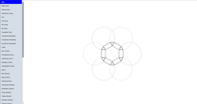](https://gorenje.github.io/capp_patterns/#One)

[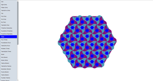](https://gorenje.github.io/capp_patterns/#Three)
[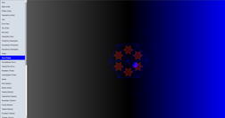](https://gorenje.github.io/capp_patterns/#Four)
[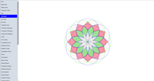](https://gorenje.github.io/capp_patterns/#Five)
[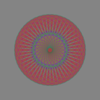](https://gorenje.github.io/capp_patterns/#Six)
[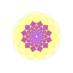](https://gorenje.github.io/capp_patterns/#Seven)
[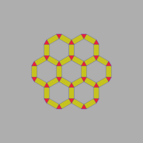](https://gorenje.github.io/capp_patterns/#Eight)
[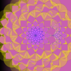](https://gorenje.github.io/capp_patterns/#Nine)

[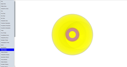](https://gorenje.github.io/capp_patterns/#Eleven)
[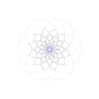](https://gorenje.github.io/capp_patterns/#Twelve)
[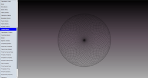](https://gorenje.github.io/capp_patterns/#Thirteen)
[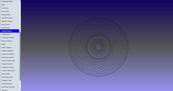](https://gorenje.github.io/capp_patterns/#Fourteen)
[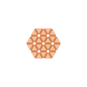](https://gorenje.github.io/capp_patterns/#Fifteen)
[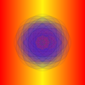](https://gorenje.github.io/capp_patterns/#Sixteen)
[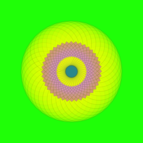](https://gorenje.github.io/capp_patterns/#Seventeen)
[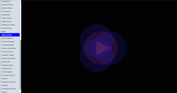](https://gorenje.github.io/capp_patterns/#Eighteen)
[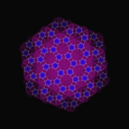](https://gorenje.github.io/capp_patterns/#Nineteen)
[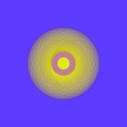](https://gorenje.github.io/capp_patterns/#Twenty)
[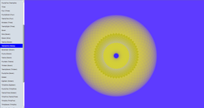](https://gorenje.github.io/capp_patterns/#TwentyOne)
[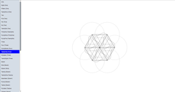](https://gorenje.github.io/capp_patterns/#TwentyTwo)

[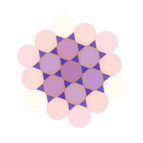](https://gorenje.github.io/capp_patterns/#TwentyFour)
[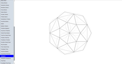](https://gorenje.github.io/capp_patterns/#TwentyFive)
[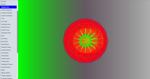](https://gorenje.github.io/capp_patterns/#TwentySix)
[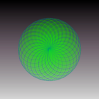](https://gorenje.github.io/capp_patterns/#TwentySeven)
[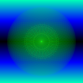](https://gorenje.github.io/capp_patterns/#TwentyEight)
[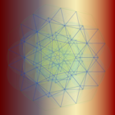](https://gorenje.github.io/capp_patterns/#TwentyNine)

[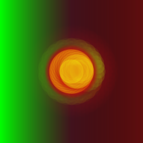](https://gorenje.github.io/capp_patterns/#ThirtyOne)
[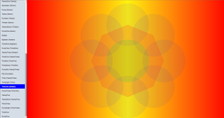](https://gorenje.github.io/capp_patterns/#ThirtyTwo)
[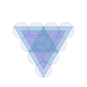](https://gorenje.github.io/capp_patterns/#ThirtyThree)
[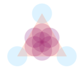](https://gorenje.github.io/capp_patterns/#ThirtyFour)
[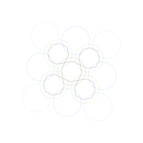](https://gorenje.github.io/capp_patterns/#ThirtyFive)
[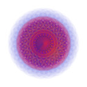](https://gorenje.github.io/capp_patterns/#ThirtySix)
[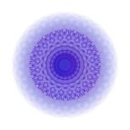](https://gorenje.github.io/capp_patterns/#ThirtySeven)

[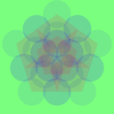](https://gorenje.github.io/capp_patterns/#ThirtyNine)
[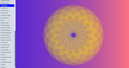](https://gorenje.github.io/capp_patterns/#Fourty)
[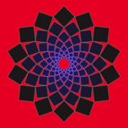](https://gorenje.github.io/capp_patterns/#FourtyOne)
[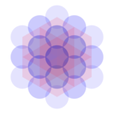](https://gorenje.github.io/capp_patterns/#FourtyTwo)
[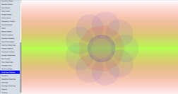](https://gorenje.github.io/capp_patterns/#FourtyThree)

[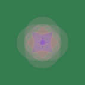](https://gorenje.github.io/capp_patterns/#FourtyFive)
[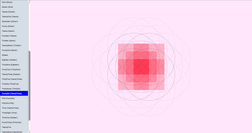](https://gorenje.github.io/capp_patterns/#FourtySix)
[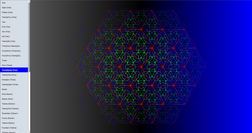](https://gorenje.github.io/capp_patterns/#FourtySeven)
[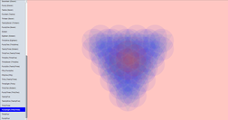](https://gorenje.github.io/capp_patterns/#FourtyEight)
[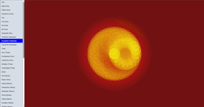](https://gorenje.github.io/capp_patterns/#FourtyNine)
[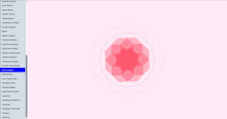](https://gorenje.github.io/capp_patterns/#Fifty)
[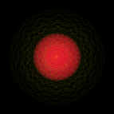](https://gorenje.github.io/capp_patterns/#FiftyOne)
[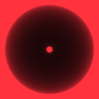](https://gorenje.github.io/capp_patterns/#FiftyTwo)
[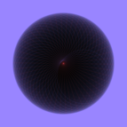](https://gorenje.github.io/capp_patterns/#FiftyThree)
[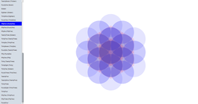](https://gorenje.github.io/capp_patterns/#FiftyFour)
[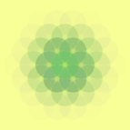](https://gorenje.github.io/capp_patterns/#FiftyFive)
[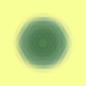](https://gorenje.github.io/capp_patterns/#FiftySix)

