<!-- Size: 1677x885, previews resized to 15% -->
[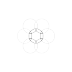](https://gorenje.github.io/capp_patterns/#One)

[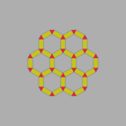](https://gorenje.github.io/capp_patterns/#Eight)

[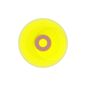](https://gorenje.github.io/capp_patterns/#Eleven)

[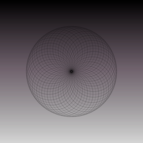](https://gorenje.github.io/capp_patterns/#Thirteen)
[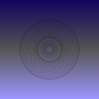](https://gorenje.github.io/capp_patterns/#Fourteen)
[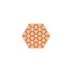](https://gorenje.github.io/capp_patterns/#Fifteen)

[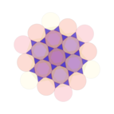](https://gorenje.github.io/capp_patterns/#TwentyFour)

[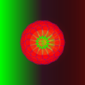](https://gorenje.github.io/capp_patterns/#TwentySix)

[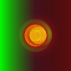](https://gorenje.github.io/capp_patterns/#ThirtyOne)

[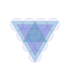](https://gorenje.github.io/capp_patterns/#ThirtyThree)

[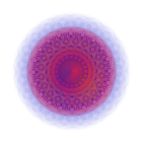](https://gorenje.github.io/capp_patterns/#ThirtySix)

[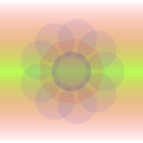](https://gorenje.github.io/capp_patterns/#FourtyThree)
[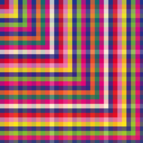](https://gorenje.github.io/capp_patterns/#FourtyFour)

[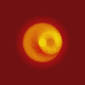](https://gorenje.github.io/capp_patterns/#FourtyNine)

[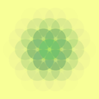](https://gorenje.github.io/capp_patterns/#FiftyFive)

