<!-- Images are svg exports (950x950), converted to png via gimp.
     Previews are resized to 15% -->

[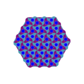](https://raw.githubusercontent.com/gorenje/capp_patterns/master/Resources/patterns/003.png)
[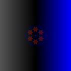](https://raw.githubusercontent.com/gorenje/capp_patterns/master/Resources/patterns/004.png)

[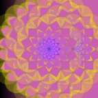](https://raw.githubusercontent.com/gorenje/capp_patterns/master/Resources/patterns/009.png)

[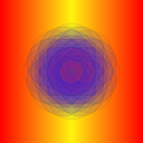](https://raw.githubusercontent.com/gorenje/capp_patterns/master/Resources/patterns/016.png)

[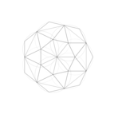](https://raw.githubusercontent.com/gorenje/capp_patterns/master/Resources/patterns/025.png)

[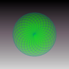](https://raw.githubusercontent.com/gorenje/capp_patterns/master/Resources/patterns/027.png)

[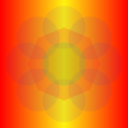](https://raw.githubusercontent.com/gorenje/capp_patterns/master/Resources/patterns/032.png)

[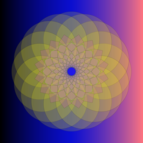](https://raw.githubusercontent.com/gorenje/capp_patterns/master/Resources/patterns/040.png)
[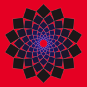](https://raw.githubusercontent.com/gorenje/capp_patterns/master/Resources/patterns/041.png)

[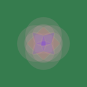](https://raw.githubusercontent.com/gorenje/capp_patterns/master/Resources/patterns/045.png)

[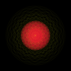](https://raw.githubusercontent.com/gorenje/capp_patterns/master/Resources/patterns/051.png)

[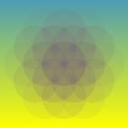](https://raw.githubusercontent.com/gorenje/capp_patterns/master/Resources/patterns/057.png)
[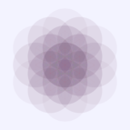](https://raw.githubusercontent.com/gorenje/capp_patterns/master/Resources/patterns/058.png)

[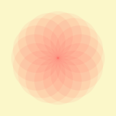](https://raw.githubusercontent.com/gorenje/capp_patterns/master/Resources/patterns/060.png)
[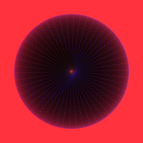](https://raw.githubusercontent.com/gorenje/capp_patterns/master/Resources/patterns/061.png)

[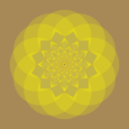](https://raw.githubusercontent.com/gorenje/capp_patterns/master/Resources/patterns/063.png)
[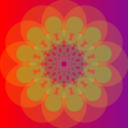](https://raw.githubusercontent.com/gorenje/capp_patterns/master/Resources/patterns/064.png)

