<!-- Images are svg exports (950x950), converted to png via gimp.
     Previews are resized to 15%
     ==> for n in `seq -f%03g 72 85` ; do convert -resize 15% ${n}.png previews/${n}.png ; done
-->

[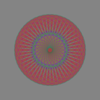](https://raw.githubusercontent.com/gorenje/capp_patterns/master/Resources/patterns/svg/006.svg)
[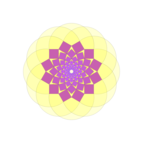](https://raw.githubusercontent.com/gorenje/capp_patterns/master/Resources/patterns/svg/007.svg)

[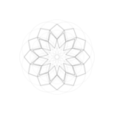](https://raw.githubusercontent.com/gorenje/capp_patterns/master/Resources/patterns/svg/010.svg)

[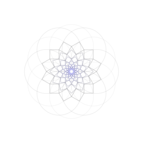](https://raw.githubusercontent.com/gorenje/capp_patterns/master/Resources/patterns/svg/012.svg)

[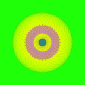](https://raw.githubusercontent.com/gorenje/capp_patterns/master/Resources/patterns/svg/017.svg)
[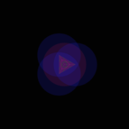](https://raw.githubusercontent.com/gorenje/capp_patterns/master/Resources/patterns/svg/018.svg)

[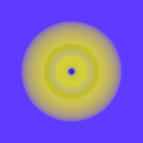](https://raw.githubusercontent.com/gorenje/capp_patterns/master/Resources/patterns/svg/021.svg)
[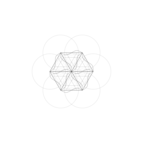](https://raw.githubusercontent.com/gorenje/capp_patterns/master/Resources/patterns/svg/022.svg)
[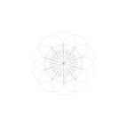](https://raw.githubusercontent.com/gorenje/capp_patterns/master/Resources/patterns/svg/023.svg)

[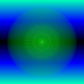](https://raw.githubusercontent.com/gorenje/capp_patterns/master/Resources/patterns/svg/028.svg)
[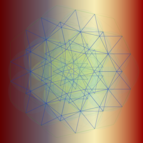](https://raw.githubusercontent.com/gorenje/capp_patterns/master/Resources/patterns/svg/029.svg)

[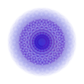](https://raw.githubusercontent.com/gorenje/capp_patterns/master/Resources/patterns/svg/037.svg)

[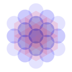](https://raw.githubusercontent.com/gorenje/capp_patterns/master/Resources/patterns/svg/042.svg)

[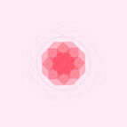](https://raw.githubusercontent.com/gorenje/capp_patterns/master/Resources/patterns/svg/050.svg)

[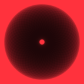](https://raw.githubusercontent.com/gorenje/capp_patterns/master/Resources/patterns/svg/052.svg)
[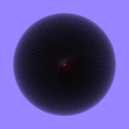](https://raw.githubusercontent.com/gorenje/capp_patterns/master/Resources/patterns/svg/053.svg)
[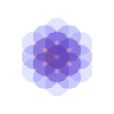](https://raw.githubusercontent.com/gorenje/capp_patterns/master/Resources/patterns/svg/054.svg)

[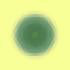](https://raw.githubusercontent.com/gorenje/capp_patterns/master/Resources/patterns/svg/056.svg)

[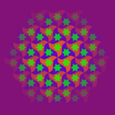](https://raw.githubusercontent.com/gorenje/capp_patterns/master/Resources/patterns/svg/059.svg)

[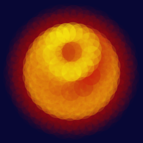](https://raw.githubusercontent.com/gorenje/capp_patterns/master/Resources/patterns/svg/065.svg)
[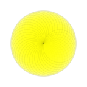](https://raw.githubusercontent.com/gorenje/capp_patterns/master/Resources/patterns/svg/066.svg)
[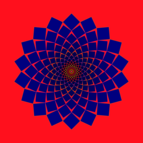](https://raw.githubusercontent.com/gorenje/capp_patterns/master/Resources/patterns/svg/067.svg)
[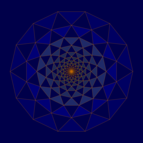](https://raw.githubusercontent.com/gorenje/capp_patterns/master/Resources/patterns/svg/068.svg)
[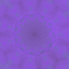](https://raw.githubusercontent.com/gorenje/capp_patterns/master/Resources/patterns/svg/069.svg)
[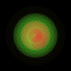](https://raw.githubusercontent.com/gorenje/capp_patterns/master/Resources/patterns/svg/070.svg)

[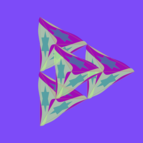](https://raw.githubusercontent.com/gorenje/capp_patterns/master/Resources/patterns/svg/072.svg)
[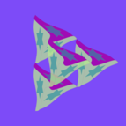](https://raw.githubusercontent.com/gorenje/capp_patterns/master/Resources/patterns/svg/073.svg)
[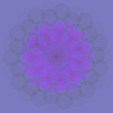](https://raw.githubusercontent.com/gorenje/capp_patterns/master/Resources/patterns/svg/074.svg)
[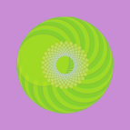](https://raw.githubusercontent.com/gorenje/capp_patterns/master/Resources/patterns/svg/075.svg)
[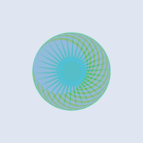](https://raw.githubusercontent.com/gorenje/capp_patterns/master/Resources/patterns/svg/076.svg)
[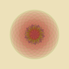](https://raw.githubusercontent.com/gorenje/capp_patterns/master/Resources/patterns/svg/077.svg)
[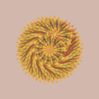](https://raw.githubusercontent.com/gorenje/capp_patterns/master/Resources/patterns/svg/078.svg)
[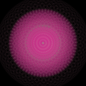](https://raw.githubusercontent.com/gorenje/capp_patterns/master/Resources/patterns/svg/079.svg)
[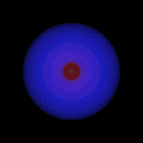](https://raw.githubusercontent.com/gorenje/capp_patterns/master/Resources/patterns/svg/080.svg)
[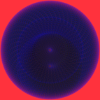](https://raw.githubusercontent.com/gorenje/capp_patterns/master/Resources/patterns/svg/081.svg)
[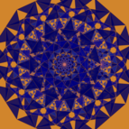](https://raw.githubusercontent.com/gorenje/capp_patterns/master/Resources/patterns/svg/082.svg)
[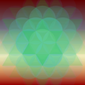](https://raw.githubusercontent.com/gorenje/capp_patterns/master/Resources/patterns/svg/083.svg)

[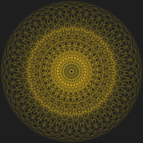](https://raw.githubusercontent.com/gorenje/capp_patterns/master/Resources/patterns/svg/085.svg)
